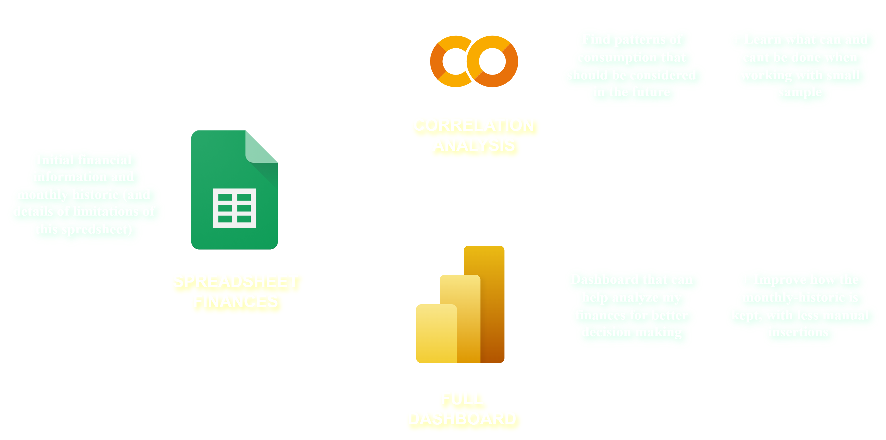

# Personal Finances Analysis

This project intends to create a system and analysis tool for personal finances.
At the end, I wish to have an ETL complete system, with clear steps to:
* Take my personal finances spreadsheet data of a month;
* Save it in a folder to have it analyzed with python code that will transform it and make a new file, with my whole historic.
* Finally, this historic will show my monthly analysis results in a PowerBI report, telling me about my current consuming behaviour, and the generated predictions for future months. 

# Step 1: Finances File

Firstly, my file with the intention of organizing my finances file includes only 2 pages:
- "Finances": current month expenses; 
- "Investments": how much money I have invested and into what. This will not be used in the analysis section, to limit the scope of this project, but can be visualized in the final PowerBI report;

## "Finances" 
Finances should:
* Be as clear as possible on the expenses that I have in that month;
* Be easy for me to know if I will end the month positively or negatively;
* Show which things I have yet to pay in that month and which I have not;
* Allow me to make decisions on what to cut with ease (example: in a month where my salary will be delayed, I might have to cut on a particular item, so I turn it off in its respective row and I can see its impact on the month results);
Every month these values will be cleared, as the current file only worries about that month, to not become cluttered.
The file has rows colored in blue, that simply have a name, to separate expenses of different categories. Additionally,
there is a "type" column that can be used to set things that are costs or incomes, and also have the option to add
special types. These special types are used when a particular spending is a group of several separate spendings throughout
the month, such as "uber" or "ifood". In order to keep track both of the overall value of this expense, and the individual ones,
we make it be a "type" and keep all expenses of that type turned off. Then, we have a special row whose cost is the sum of all
expenses of that special type. These special costs will be called "dynamic expense" in this project. Not only do I want to keep track of these dynamic expenses, I want to have as many details as possible about them: "what" was purchased, "where" it was purchased, "when" it was purchased, and even why when possible.  
At the end of every month the finances file must be duplicated in order to keep record of every detail from previous months.

# Step 2: Correlation Analysis
This repository has a ipynb file  that was used to research the data from my personal finances, and see which tools would prove most useful to be passed to the official modular code.
The analysis made is fully aware that the usefulness of many of the models on it will be statistically non-significant for predictions, given the small sample. It as an exploratory view of the data, bringing and testing different levels of hypothesis about its behaviour. 
There is further explanation in the file, but in summary the following steps were employed:
* Data cleaning (removing empty and redundant information) and analysis of correlation;
* Linear regression using "time" (index) as input variable;
* Simple Auto Regression;
* Logistical Regression and Decision Trees;
* Predictions for every combination of Factors;

The results of this research will be considered in the next step.

# Step 3: Python Code
A python project will be created to read a group of finances files and create a historic file from them.
Additionally, it will make a page in the file for predictions that will be generated from the data. 
This project doesn't require an interface, as it will only have a single functionality and only files as input. 

# Step 4: Dashboard in Power BI
Divided into 3 Pages:
- **Spending Behavior:** Shows the evolution of spending throughout each month, the dynamic expenses, and the final results of the month;
- **Forecasts:** Based on the studied models, it presents expected cost data for the upcoming months;
- **Investments:** A simple screen that shows the current investment amounts. It will be a straightforward screen for this project.# Data secrecy

Since the financial data that was explored was personal, I followed measures to keep my actual data privated.
Firstly, I considered the following reference: https://mostly.ai/blog/data-anonymization-in-python

But ultimately decided for a practical approach: Copying the original file and filling out fake information. 
Every dataset can count a different narrative, and therefore the fake data might be modified in the future to reflect 
relations found in the original data, with the intention of keeping the actual data hiddent whilst still discussing 
about what was learned.
